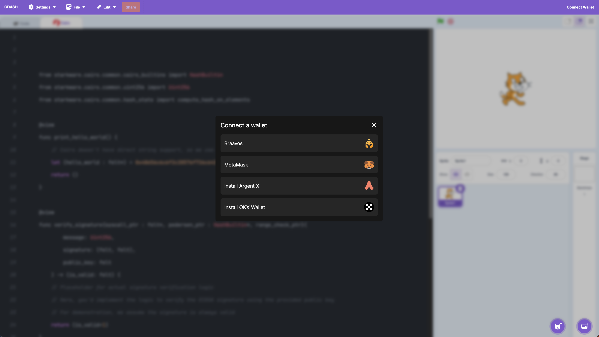

# Crash



CRASH is a learning platform inspired by MIT Scratch, designed to teach kids blockchain technology and programming using Cairo on the StarkNet blockchain. It aims to make blockchain and smart contract development accessible and engaging for young learners.


### Learning Use cases

1. Sharing Secrets Safely:

```sratch
Two sprites want to share a secret message. They use a simple code to encrypt it
before sending it across the screen.


## Script
when green flag clicked
ask [Enter your secret message:] and wait
set [secret message] to (answer)
set [coded message] to []
replace item (1) of [secret message] with [A]
replace item (2) of [secret message] with [B]
say (coded message)

```

Narrative:
"Whispering Willow and Chatterbox Chipmunk want to share a secret. But they don't want
anyone else to know! They use a special code to change their message. Can you help them
create the code and send their secret message safely?"


2. The Honest Ledger:

```scratch
Sprites represent friends sharing toys. A simple list (the "ledger") keeps track of who
has which toy.

# Script
when green flag clicked
set [ledger v] to [Emily has the ball, Ben has the car]
when this sprite clicked
ask [Who has which toy?] and wait
add (answer) to [ledger v]
say (ledger)

```

Narrative:

"Lily, Max, and Sophie love to share their toys. They use a special list called a ledger to
remember who has what. Can you help them update the ledger when they trade toys? This is like how a blockchain keeps track of thing!


